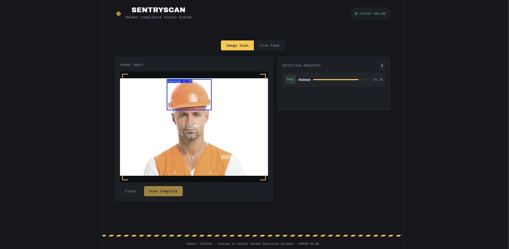
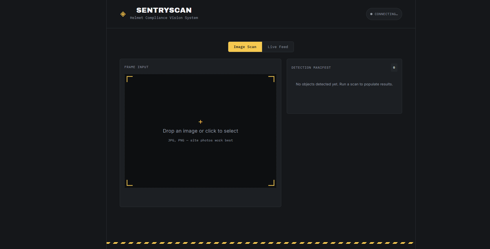

# 🦺 SentryScan — Safety Helmet Detection System

A deep learning-based application that detects whether a person is wearing a safety helmet — from uploaded photos **and** live camera feeds — built using **YOLOv8**, **FastAPI**, and **React**.

🔗 **Live Demo:** [safety-helmet-detector.vercel.app](https://safety-helmet-detector.vercel.app)
💻 **GitHub:** [github.com/khushalcodess/safety-helmet-detector](https://github.com/khushalcodess/safety-helmet-detector)

---

## 📌 Overview

Workplace safety compliance is a critical concern in industries like construction and manufacturing. This project uses computer vision to automatically detect helmet usage in real time, helping flag safety violations without manual monitoring.

The system supports:
- 📷 **Image upload detection** — upload a photo and get instant helmet detection results
- 🎥 **Live camera detection** — real-time helmet detection through your webcam feed

---

## 📊 Results

Trained on **28,000+ labeled images** (Helmet / No Helmet), the model was evaluated on a fully held-out test set never seen during training:

| Metric | Validation Set | Test Set |
|---|---|---|
| mAP@50 | 90.1% | **91.8%** |
| mAP@50-95 | 56.8% | 58.2% |
| Precision | 82.8% | 85.6% |
| Recall | 87.6% | 88.4% |

- **Class confusion under 1%** — the model rarely mistakes a helmet for no-helmet or vice versa; its main limitation is missed detections on small/occluded subjects, not misclassification
- **Test-set performance slightly exceeded validation performance across every metric**, indicating no overfitting
- **Inference speed:** ~0.8ms preprocessing + 1.7-3.3ms inference + ~1ms postprocessing per image — well within real-time requirements for live webcam use
- **Generalization tested** on out-of-distribution images (e.g., bicycle helmets).

---

## 🛠️ Tech Stack

| Layer | Technology |
|---|---|
| Model | YOLOv8 (Ultralytics) |
| Backend | FastAPI (Python) |
| Frontend | React |
| Backend Hosting | Render |
| Frontend Hosting | Vercel |

---

## ⚙️ How It Works

1. The React frontend captures an image (uploaded file or live camera frame)
2. The frame is sent to the FastAPI backend via a REST API call
3. The backend runs YOLOv8 inference on the frame
4. Detection results (helmet / no helmet, bounding boxes, confidence scores) are returned and rendered on the frontend in real time

---

## 🚀 Getting Started

### Prerequisites
- Python 3.9+
- Node.js 16+
- pip / npm

### Backend Setup
```bash
cd backend
python -m venv venv
source venv/bin/activate   # Windows: venv\Scripts\activate
pip install -r requirements.txt
uvicorn app.main:app --host 0.0.0.0 --port 8000
```

### Frontend Setup
```bash
cd frontend
npm install
npm run dev
```

### Environment Variables
Create a `.env` file in the frontend with:
```
VITE_API_URL=https://your-backend-url.onrender.com
```

---

## 📸 Screenshots

**Detection Result — Helmet Detected (78.7% confidence)**


**Live Feed Interface**


---

## 🧠 Model Details

- **Architecture:** YOLOv8n (nano) — chosen for fast training/inference and low memory footprint
- **Classes:** Helmet, No Helmet (originally 3 classes; a severely underrepresented and noisily-annotated "Worker" class was removed after data audit)
- **Training Data:** [Safety Helmet Detection Dataset](https://www.kaggle.com/datasets/archisman24/new-dataset) (Kaggle) — 20,526 train / 4,605 val / 2,572 test images
- **Training Config:** 50 epochs, 640x640 image size, batch size 16, Tesla T4 GPU (~2.7 hrs)
- **Framework:** Ultralytics YOLO, exported to **ONNX** for framework-independent deployment

---

## 🔮 Future Improvements

- [ ] Add violation logging with timestamps
- [ ] Multi-camera / multi-stream support
- [ ] Alert notifications (email/SMS) on violations
- [ ] Model accuracy improvements with expanded dataset

---

## 📄 License

This project is licensed under the MIT License.

---

## 🙋‍♂️ Author

**Khushal Patil**
🔗 [LinkedIn](https://www.linkedin.com/in/khushalcodess) | [Portfolio](https://portfolio-pearl-five-17.vercel.app) | [GitHub](https://github.com/khushalcodess)
